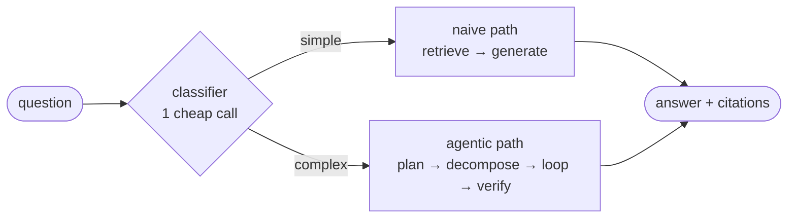

# Adaptive RAG

**A retrieval-augmented QA system that classifies every question and sends it down the
cheapest path that can actually answer it.**

Simple lookups take **one** LLM call. Multi-hop questions take an agentic path that
plans, decomposes, retrieves in a loop, grades its own evidence and self-checks the
answer — **5–17** calls. The decision is made per query by a small classifier, so the
expensive machinery runs only when it earns its cost.

Built with LangGraph, ChromaDB, and local embeddings, behind a Streamlit UI that shows
the route, the sub-questions, and every step as it happens.

**[Full documentation →](docs/documentation.md)** — architecture, diagrams, design
decisions, and configuration reference.

---

## The core idea

Naive RAG — one retrieval, one generation — is fast and cheap, but it fails on
questions where no single passage holds the answer: comparisons, multi-hop chains.
Agentic RAG handles those by planning and looping, but costs an order of magnitude
more.

The mistake is picking one. Real query streams are *mostly* simple, so running the
agentic pipeline on everything wastes most of its budget.

**So decide per query:**



| Path | Shape | LLM calls |
|---|---|---|
| `naive` | retrieve → expand to parents → generate | **1** |
| `agentic` | plan → decompose → per-hop (retrieve → grade → reformulate ↺) → synthesize → self-check | **5–17** |

That ratio is the project. Everything else exists to make it safe to rely on.

---

## Key features

**Complexity router.** One cheap classification call picks the path. It fails open — a
rate limit or outage falls back to the default path rather than failing the query.
Paths live in a registry, so adding one is a registration, not a rewrite.

**Pluggable retrieval, config-only.** Four components — `vector`, `bm25` (RRF-fused),
`hyde`, `rerank` — each toggled by one line of `config.yaml`. Components declare a
*stage* (pre-retrieval / retrieval / post-retrieval), so every combination of flags
produces a valid pipeline; HyDE can't accidentally run after the search it was meant to
rewrite. Adding a component is one class plus one registry entry, with no caller
changes.

**Parent-child context expansion.** Small chunks retrieve better; large chunks generate
better. So documents split into page-sized parents, then 512-token children. Only
children are embedded and searched — precise matching — then each hit is mapped back
through `parent_id`, parents are deduplicated, and the LLM receives whole pages instead
of disconnected fragments.

**Agentic path with bounded agency.** A LangGraph state machine that plans, decomposes
into lookup-shaped sub-questions, retrieves per hop, grades its own evidence, and
rewrites queries that came back thin — then synthesizes across hops and self-checks for
grounding. Every loop cap is enforced on a graph edge, not requested in a prompt, so no
combination of model outputs can make it run away.

**Observable by construction.** The UI streams the route decision, then the
sub-questions, then each graph node as it fires. The live feed *is* the recorded trace.

---

## Quickstart

```bash
python3 -m venv .venv && source .venv/bin/activate

# CPU build of torch first — the default wheel pulls ~5GB of unused CUDA libraries
pip install --index-url https://download.pytorch.org/whl/cpu torch
pip install -r requirements.txt

cp .env.example .env      # add GROQ_API_KEY and GOOGLE_API_KEY
```

```bash
# Drop .txt / .md / .pdf into data/, then index (fully local, no API key needed)
python scripts/ingest.py

streamlit run app/streamlit_app.py
```

Re-running `ingest.py` is safe — unchanged files are skipped, edited files are
replaced. `config.yaml` is the single control panel for chunking, retrieval
components, models per role, and the agentic loop caps.

See the **[full documentation](docs/documentation.md)** for the architecture diagrams,
the agentic state machine, and the configuration reference.

---

## Future scope

- **Evaluation & benchmarking** — the most valuable next step, deliberately excluded so
  far. `RagResult` is a uniform contract across both paths, so a harness can wrap
  `stack.run(query)` untouched. This would measure recall@k, faithfulness, and most
  importantly **router accuracy** — how often the cheap path was genuinely sufficient.
- **Conversational context** — every query is currently independent. Follow-ups need
  history-aware query rewriting plus session state.
- **Token optimisation** — context compression before synthesis, caching classifier
  verdicts, and trimming graded evidence to the passages actually cited.
- **More paths** — the registry already supports it; a knowledge-graph path for
  relationship-heavy questions is the natural third.

---

## Tech stack

Python 3.11+ · LangGraph · ChromaDB · sentence-transformers (`bge-small-en-v1.5`,
`ms-marco-MiniLM-L-6-v2`) · Groq · Google Gemini · Streamlit
