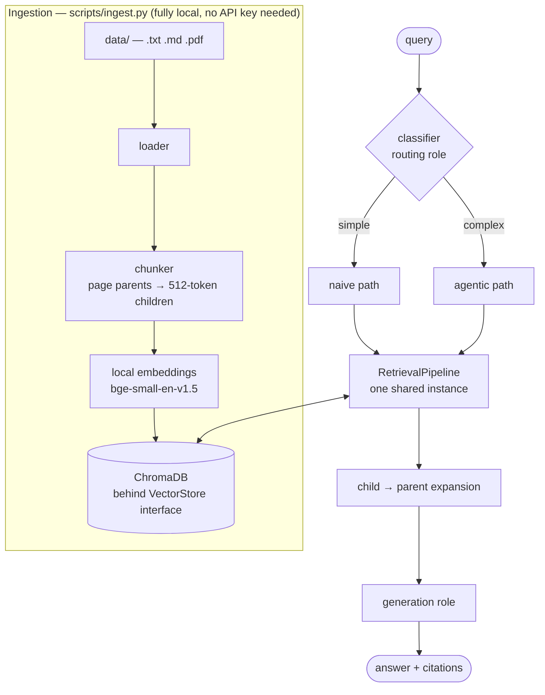
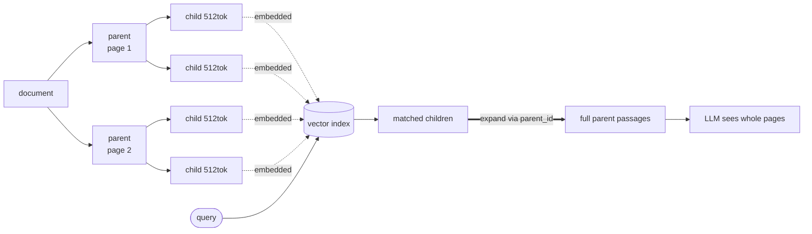
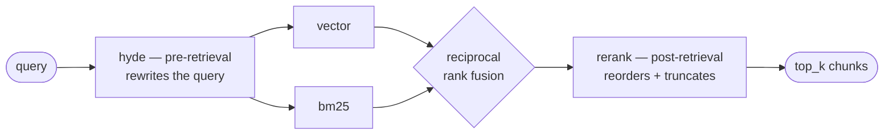
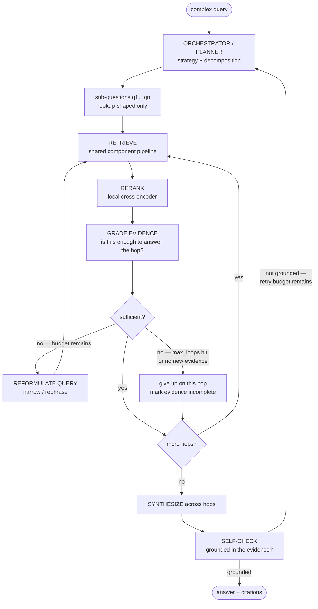

# Adaptive RAG

**A retrieval-augmented QA system that classifies every question and sends it down the
cheapest path that can actually answer it.**

Simple lookups take one LLM call. Multi-hop questions take an agentic path that plans,
decomposes, retrieves in a loop, grades its own evidence and self-checks the answer.
The decision is made per query by a small classifier, so the expensive machinery runs
only when it earns its cost.

Built on LangGraph, ChromaDB, and local embeddings, with a Streamlit UI that shows the
route, the sub-questions, and every step as it happens.

---

## Contents

- [The problem](#the-problem)
- [System architecture](#system-architecture)
- [Modularity: pluggable retrieval](#modularity-pluggable-retrieval)
- [The router](#the-router)
- [The agentic path](#the-agentic-path)
- [Models by role](#models-by-role)
- [What's novel here](#whats-novel-here)
- [Quickstart](#quickstart)
- [Configuration](#configuration)
- [Project layout](#project-layout)
- [Future scope](#future-scope)

---

## The problem

**Naive RAG** — one retrieval, one generation — is fast and cheap. It also fails
predictably: ask it to compare two documents, or to answer something where one fact
leads to the next, and it retrieves passages about *the question* rather than the
passages that together contain *the answer*. No single chunk holds a comparison.

**Agentic RAG** solves that by planning, decomposing into sub-questions, retrieving
per hop, judging whether the evidence is sufficient, and rewriting queries that came
back thin. It works — and it costs an order of magnitude more calls and latency.

The mistake is choosing one. Real query streams are *mostly* simple: definitions,
single facts, "what is X". Running the agentic pipeline across all of them spends the
expensive path's budget on questions a single retrieval would have answered.

**This project's answer is to decide per query.** A small, fast classifier labels the
question and dispatches it. On this repo:

| Path | Shape | LLM calls |
|---|---|---|
| `naive` | retrieve → expand to parents → generate | **1** |
| `agentic` | plan → decompose → per-hop (retrieve → grade → reformulate ↺) → synthesize → self-check | **5–17** |

That ratio *is* the project. Everything else exists to make it safe to rely on.

> **On the numbers in this document.** Figures come from running the system against one
> corpus of 8 documents / 236 chunks. They are indicative observations, not benchmark
> results — a proper evaluation harness is deliberately [future scope](#future-scope).

---

## System architecture



Every boundary that might need to change later is an interface: `VectorStore`,
`Embedder`, `LLMProvider`, `RetrievalComponent`. Chroma can be swapped without callers
knowing; so can the embedding model or a provider.

Both paths share **one** `RetrievalPipeline` instance. There is no second copy of
retrieval logic that could drift, and a retrieval config change applies identically to
both.

### Parent-child chunking and context expansion

There's a tension at the heart of chunking. **Small chunks retrieve better** — a
512-token chunk about one topic matches a question about that topic cleanly, while a
large chunk dilutes its own embedding across everything it covers. But **large chunks
generate better** — hand an LLM a 512-token fragment cut mid-argument and it answers
from a fragment.

Parent-child chunking takes both. Documents split into page-sized **parents**, then
each parent splits into 512-token **children**:



**Only children are embedded and searched** — so matching is precise. At generation
time each retrieved child is mapped back to its parent via `parent_id`, parents are
**deduplicated** (several matching children usually share one parent), and the *full
parent text* goes to the LLM.

The practical effect: `top_k: 5` children typically collapse to 2–3 unique parents, so
the model receives a few complete pages instead of five disconnected fragments — while
the search that found them still ran at child granularity.

Two design choices keep this bounded and swappable:

- **Parents are page-sized, not whole documents.** A whole-document parent would push
  30k+ tokens into every prompt and trigger lost-in-the-middle, where the model
  overlooks the relevant passage buried in the middle. Page parents cap context
  regardless of whether a source file is 2 pages or 200. Granularity is configurable
  (`page` / `block` / `document`).
- **`src/generation/context.py` is the only module that knows where parent text
  lives.** Swapping metadata storage for a separate docstore touches one function.

A total-context budget (`generation.max_context_chars`) caps the combined parent text,
so a wide candidate set can never blow up the prompt.

---

## Modularity: pluggable retrieval

Four components, each toggled by one line of `config.yaml`:

| Component | What it does | Cost |
|---|---|---|
| `vector` | Dense search over child chunks (`bge-small-en-v1.5`) | **local** |
| `bm25` | Sparse term matching, fused with dense results via reciprocal rank fusion | **local** |
| `hyde` | Has the LLM draft a hypothetical answer and searches with *that*, so the probe reads like a passage rather than a question | 1 LLM call |
| `rerank` | Local cross-encoder rescores the shortlist; retrieval widens to `top_k × fetch_multiplier` candidates when enabled | **local** |



### Why stages, not just config order

Components are declared in a config list, but order in that list can't be the whole
story: **HyDE must rewrite the query before anything searches it**, and **rerank can
only reorder candidates that already exist**. A naive "run them in the order listed"
pipeline silently breaks when someone puts `hyde` last — it becomes a no-op that still
costs a call.

So each component declares a *stage* — pre-retrieval, retrieval, post-retrieval — and
config order applies only *within* a stage. Every combination of flags produces a valid
pipeline.

This was verified across **8 flag combinations, changing config only and touching no
code** — including a deliberately scrambled declaration order
(`rerank, bm25, vector, hyde`) which correctly assembled as
`hyde → vector → bm25 → rerank`.

Retrieval-stage components **fuse rather than overwrite**, so `vector` and `bm25`
compose in either order. (This was a real bug found by that scrambled-order test: the
vector component used to replace existing candidates, silently discarding BM25's
results and degrading hybrid search to dense-only with no error.)

### Adding a component

One class implementing `RetrievalComponent`, one entry in `COMPONENT_REGISTRY`
(`src/retrieval/pipeline.py`), one config flag. No caller changes.

`hyde` is the only component that spends API quota — which is why it's off by default.
`bm25` and `rerank` are free to leave on.

---

## The router

One cheap classification call labels each query `simple` or `complex` and dispatches it.

**It fails open.** A rate limit, a provider outage, or an unparseable reply falls back
to `default_path` rather than failing the query. The classifier sits in front of
*everything*, so it must never be the reason a question goes unanswered — this was
observed under a real provider outage, not simulated.

**It's extensible.** Paths live in a registry, so adding one (a knowledge-graph path,
say) is a registration rather than a rewrite. This was verified before the agentic path
existed: registering a stub under the name `agentic` immediately caused complex queries
to route to it, with no code change.

**It's optional.** `router.enabled: false` sends everything to `default_path` and makes
zero classifier calls.

On a hand-written set of six queries (three single-fact, three multi-hop), the
classifier agreed with the intended label 6/6. That's a smoke check, not an accuracy
measurement — see [future scope](#future-scope).

---

## The agentic path

Built on LangGraph. This is where the interesting work happens.



The graph state is explicit and typed (`src/agentic/state.py`): per-hop evidence, loop
counters, grading verdicts, and the trace all live in one auditable object.

### Cost is bounded by construction

Every limit is enforced on a **graph edge**, not requested in a prompt. A model asked
politely to "stop after three attempts" will eventually not; a counter checked on a
conditional edge always will — and that matters when each extra iteration spends
rate-limited quota.

```
worst case ≈ 1 plan
           + max_sub_questions × (1 grade + max_loops × (1 reformulate + 1 grade))
           + 1 synthesis + 1 self-check
           , all × (max_self_checks + 1)
```

All three caps are config values: `max_sub_questions`, `max_loops`, `max_self_checks`.

### It stops when looping is pointless

If a reformulated query returns **zero new chunks**, the corpus simply doesn't contain
the answer — rewriting again would spend two more calls to re-read the same text. The
graph moves on instead.

This came directly from reading a real trace: an early run burned 12 of 19 calls
looping on evidence that didn't exist. Adding this exit, plus teaching the planner to
emit only *lookup-shaped* sub-questions (never "what does X have that Y doesn't" — no
passage contains a comparison), took the same query from **19 calls to 11**.

### It fails open, per node

If a provider dies mid-graph, individual nodes degrade and the run still returns rather
than stalling in a retry loop that spends quota. With *both* providers exhausted, the
graph still completed — observed, not theorised.

### Worked example: an honest "I don't know"

Asked for information the corpus genuinely doesn't contain, every guard fires at once:

```
orchestrator: Look up GPU hours and hardware cost separately -> 2 sub-question(s)
retrieve[1] "...GPU hours for training RAGBench's evaluation m": 5 hits, 5 new
grade[1]: insufficient (GPU hours for training RAGBench's evaluation models)
reformulate[1] #1: 'RAGBench evaluation model training computational resources GPU hours'
retrieve[1] '...': 5 hits, 1 new
grade[1]: insufficient
reformulate[1] #2: 'RAGBench evaluation model training GPU hours utilized'
retrieve[1] '...': 5 hits, 1 new
grade[1]: insufficient
reformulate[1] #3: '...GPU hours c'
retrieve[1] '...': 5 hits, 0 new
grade[1]: insufficient
sub-question 1 gave up after 3 reformulation(s); using what was found
...
synthesize: 6 parent(s) across 2 hop(s)
self-check: grounded
agentic: 17 LLM call(s) total
```

And the answer:

> Based on the provided sources, the exact GPU hours and hardware costs for training
> RAGBench's evaluation models are **not specified**. The sources mention that details
> regarding training and hyperparameters are located in Appendix 7.8 of the paper, but
> that information is incomplete in the provided excerpts.

The loop ran, hit its cap, gave up cleanly, and reported the gap — including *where the
answer would be* — instead of inventing numbers.

---

## Models by role

Roles are mapped to providers and models in `config.yaml`, never hardcoded at call
sites. What each role needs is a *character*, not a specific vendor:

| Role | Character needed | Why |
|---|---|---|
| `routing` | smallest, fastest, highest throughput | runs on **every** query — must be near-free and low-latency or it defeats the point |
| `reasoning` | strong instruction-following | planning, grading, reformulation; quality here decides how many loops get spent |
| `generation` | long context, good prose | writes the final cited answer from page-sized parents |
| **embeddings** | **local, CPU** | the highest-volume operation — removed from the API surface entirely |
| **reranking** | **local, CPU** | scores a shortlist on every query — also fully local |

### Local-first by design

The two highest-volume operations never touch an API. Embedding runs at ~41 ms for a
warm query and ~64 documents in ~0.14 s on CPU, producing 384-dimension normalized
vectors — fast enough that keeping it local costs nothing in practice. Reranking uses a
local cross-encoder.

Only `routing`, `reasoning` and `generation` hit rate-limited endpoints: **1 call** for
a naive query, **5–17** for an agentic one.

### Rate limits are handled, not guessed

`src/llm/router_llm.py` wraps every provider call:

- exponential backoff **with jitter**, honouring `Retry-After`
- `x-ratelimit-*` response headers treated as the source of truth — **no quota numbers
  are hardcoded anywhere**, because they change and providers disagree
- a long `Retry-After` is read as a *daily* cap and triggers immediate failover instead
  of a long sleep
- cross-provider failover per role, logged when it fires

**A lesson worth stating plainly: a fallback that is also capped is not a fallback.**
Generation originally fell back to a large model whose daily token budget a handful of
RAG prompts could exhaust. When the primary throttled, traffic landed on an already-dead
model and queries failed. The fallback now targets a smaller model with far more daily
headroom — chosen for *availability*, not peak quality.

---

## What's novel here

1. **Cost-aware routing as the organising principle** — not a feature bolted onto a RAG
   pipeline, but the reason the architecture is shaped the way it is.
2. **Config-only modularity** — stage ordering makes every combination of component
   flags valid; verified across 8 combinations with zero code edits.
3. **Parent-child context expansion** — search at child granularity for precision,
   generate from deduplicated page-sized parents for context, with the storage
   decision isolated behind one function.
4. **Bounded agency** — loop caps enforced on graph edges rather than requested in
   prompts, plus a no-new-evidence early exit that cut one query's cost by ~40%.
5. **Header-driven rate-limit handling** — no hardcoded quota constants; the provider's
   own headers decide.
6. **One retrieval pipeline, both paths** — shared instance, so there's no duplicate
   logic to drift apart.
7. **Observable by construction** — the UI streams the route decision, then the
   sub-questions, then each node as it fires. The live feed *is* the recorded trace, so
   the two can't disagree.

---

## Quickstart

```bash
python3 -m venv .venv && source .venv/bin/activate

# Install the CPU build of torch FIRST. Everything runs on CPU, and the default
# PyPI wheel pulls in ~5GB of unused CUDA libraries.
pip install --index-url https://download.pytorch.org/whl/cpu torch
pip install -r requirements.txt

cp .env.example .env      # then fill in GROQ_API_KEY and GOOGLE_API_KEY
```

```bash
# 1. Drop .txt / .md / .pdf files into data/
# 2. Index them — fully local, no API key required
python scripts/ingest.py

# 3. Ask questions
streamlit run app/streamlit_app.py
```

Re-running `ingest.py` is safe: unchanged files are skipped, edited files have their
stale chunks removed and replaced. `--reset` rebuilds from scratch.

`scripts/smoke_retrieval.py "your query"` runs retrieval and parent expansion with **no
LLM call**, which is useful for checking chunking without spending quota.

> **Restart the app after editing `src/` or `config.yaml`.** Streamlit's
> `@st.cache_resource` pins the config and pipeline objects for the session, so a
> running instance will keep using the old ones.

> **Model names go stale.** `gemini-2.5-flash` and `-flash-lite` are already retired for
> new API keys — they return 404, which is *not* a quota error. If generation starts
> failing over on every query, check the model in `config.yaml` against the models your
> key can actually list.

---

## Configuration

`config.yaml` is the single control panel.

| Key | Effect |
|---|---|
| `retrieval.components` | Toggle `vector` / `bm25` / `hyde` / `rerank` |
| `retrieval.top_k` | How many child chunks feed parent expansion |
| `retrieval.fetch_multiplier` | Candidate pool widening when `rerank` is on |
| `chunking.parent.granularity` | `page` (default), `block`, or `document` |
| `llm.<role>` | Provider + model per role, with optional `fallback_provider` / `fallback_model` |
| `router.enabled` | `false` sends everything to `router.default_path` |
| `agentic.max_sub_questions` | Hops the planner may create |
| `agentic.max_loops` | Retrieve→grade→reformulate cycles per hop |
| `agentic.max_self_checks` | Times an ungrounded answer may bounce back to the planner |
| `generation.max_answer_tokens` | Answer length cap (also reserved against per-minute quota) |

---

## Project layout

```
src/config.py         typed config + .env loading
src/embeddings/       Embedder protocol; local sentence-transformers impl
src/vectorstore/      VectorStore interface; Chroma implementation
src/llm/              provider interface, Groq, Gemini, retry/fallback router
src/ingest/           loader (txt/md/pdf), parent-child chunker, idempotent index
src/retrieval/        RetrievalComponent interface, components, staged pipeline
src/generation/       child→parent expansion, grounded answer generation
src/router/           complexity classifier + extensible path dispatch
src/agentic/          typed graph state, nodes, LangGraph wiring
src/pipelines/        RagResult contract + naive and agentic paths
src/bootstrap.py      wires the object graph; used by CLI and Streamlit
app/streamlit_app.py  UI with live route / sub-question / step streaming
```

---

## Future scope

**Evaluation & benchmarking.** Deliberately excluded so far, and the most valuable next
step. `RagResult` is a uniform contract across both paths, so a harness can wrap
`stack.run(query)` without touching pipeline code. This is what would turn the
observations in this document into measurements: recall@k and faithfulness, and most
importantly **router accuracy** — how often the cheap path was genuinely sufficient, and
what a wrong routing decision costs in each direction.

**Conversational context.** Every query is currently independent. Follow-ups ("what
about the other one?") need history-aware query rewriting before retrieval, plus session
state threaded through `RagResult`.

**Token optimisation.** Context compression before synthesis; caching classifier
verdicts for repeated queries; trimming graded evidence down to the passages the grader
actually cited rather than passing whole parents to every node.

**More paths.** The registry already supports it — a knowledge-graph path for
relationship-heavy questions is the natural third, and would need no router changes.
